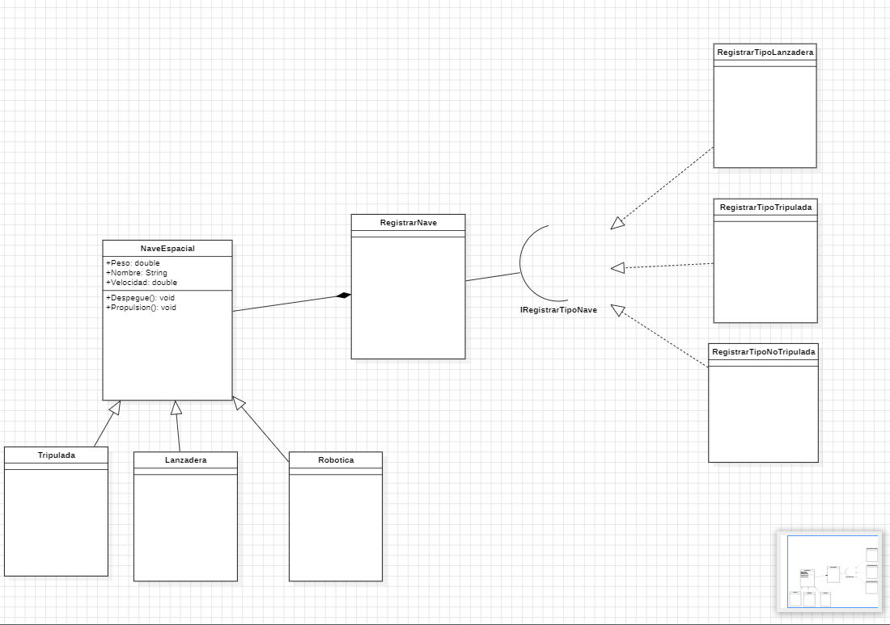

# Taller de diseño y programación: Abstracciones, interfaces y polimorfismo

## Diagrama UML



## Abstracciones

Nosotros definimos lo que es una clase abstracta **NaveEspacial**. Se creo algunas
propiedades de ejemplo por ejemplo, _nombre,peso,velocidad_. Estas propiedades son
reutilizables para nuestras clases hijas que extenderan de esta clase: **Tripulada,Lanzadera,Robotica**_

```java
public abstract class VehiculoEspacial {
    protected double peso;
    protected String nombre;
    protected double velocidad;

    //Estos metodos abstractos nos pueden servir para hacer una sobrecarga y asi poder tener lo
    //que es el polimorfismo.
    public abstract String Despegue();
    public abstract void Propulsion();


    public void setPeso(double peso) {
        this.peso = peso;
    }
    public double getPeso() {
        return this.peso;
    }

    public void setNombre(String nombre) {
        this.nombre = nombre;
    }
    public String getNombre() {
        return this.nombre;
    }

    public void setVelocidad(double velocidad) {
        this.velocidad = velocidad;
    }
    public double getVelocidad() {
        return this.velocidad;
    }
}
```

## Interfaces


Nosotros definimos una interfaz **IRegisterTipoNave**. La finalidad de haber
creado esta clase es para extender en funcionalidad nuestra clase **RegistrarNave**
. Lo que terminamos aplicando lo que es el segundo principio SOLID (Abierto-Cerrado).
Se puede extender la funcionalidad de una clase pero no cambiar a la clase misma.

```java
package Data;

import Naves.VehiculoEspacial;

import java.io.IOException;


public interface IRegistrarTipoNave {

    public void RegistrarNave(VehiculoEspacial vehiculo) throws IOException;
}

```

Entonces la interfaz es **implementada** debidamente por clases el cual realizan
tareas completamente distintas, al momento de guardar los datos.

```java
public class RegistrarTipoLanzadera implements IRegistrarTipoNave { ... }
public class RegistrarTipoNoTripulada implements IRegistrarTipoNave { ... }
public class RegistrarTipoTripulada implements IRegistrarTipoNave { ... }
```

```java

package Data;

import Naves.VehiculoEspacial;

import java.io.IOException;

public class RegistrarNave {
    
    //utlizamos como inyeccion de dependencia la interfaz. Estoy es muy bueno,
    //porque esta clase no tiene que saber como se guardaran los datos.
    private IRegistrarTipoNave registrarNave;

    public RegistrarNave(IRegistrarTipoNave registrarNave){
        this.registrarNave = registrarNave;
    }

    public void GenerarGuardado(VehiculoEspacial vehiculo) throws IOException {
        this.registrarNave.RegistrarNave(vehiculo);
    }
}

```

## Polimorfismo

