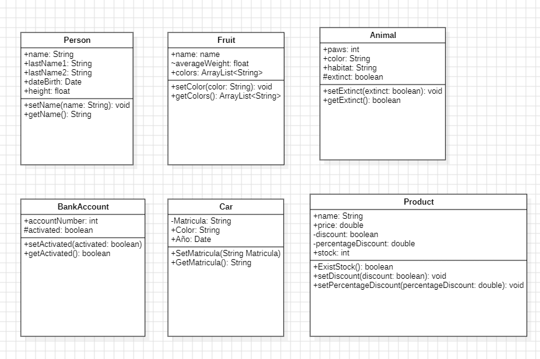

# Taller Objetos Java

## Manejo de Clases y Objetos en Java

En este ejercicio acabamos de realizar la creación de 6 clases 
respectivas. Cada una de ellas tiene sus atributos y metodos, junto
con su nivel de acceso (public, private, protected)

La creacion de mis 3 clases acotadas, los cree con un nivel de abstracción mayor.
Eso quiere decir que estas 3 clases pueden ser reutilizadas para cualquier clase
de extensión que se quiera realizar.

Por ejemplo, mi clase Producto tiene una abstracción de nivel alto, porque esta
clase puede ser reutilizada sus propiedades y metodos por clases hijas.